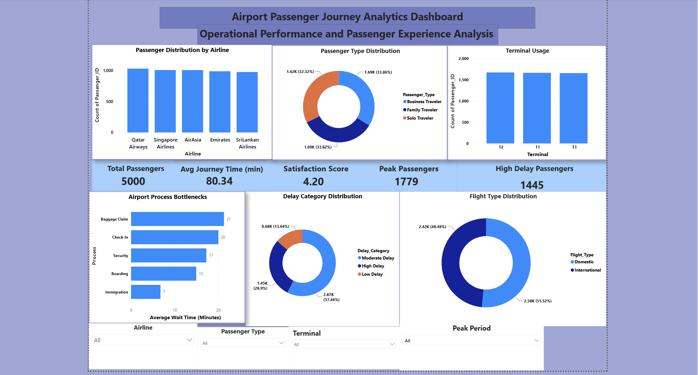
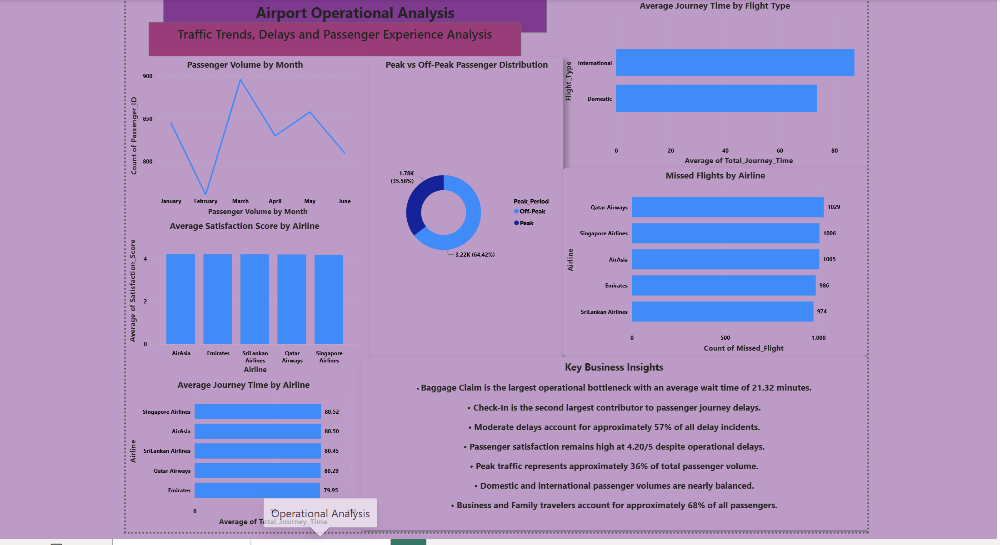

# ✈️ Airport Passenger Journey Analytics Dashboard
## 📌 Project Overview

The Airport Passenger Journey Analytics project analyzes passenger movement and operational performance across different stages of the airport journey. The project aims to identify bottlenecks, improve passenger satisfaction, and support data-driven operational decision-making.

The solution combines Business Analysis methodologies, Python data preparation, SQL analysis, and interactive Power BI dashboards.

---

## 🎯 Business Problem

Modern airports experience increasing passenger traffic which can create delays and congestion throughout the passenger journey.

Major operational challenges include:

- Long check-in waiting times
- Security screening congestion
- Immigration delays
- Boarding inefficiencies
- Baggage claim bottlenecks

These issues negatively affect passenger satisfaction and airport operational efficiency.

---

## 🎯 Project Objectives

- Identify operational bottlenecks within passenger journeys.
- Analyze passenger behavior and travel patterns.
- Monitor passenger satisfaction levels.
- Measure airport operational performance using KPIs.
- Support decision-making through interactive dashboards.
- Provide recommendations for operational improvements.

---

## 🛠 Tools and Technologies

| Category | Tools |
|----------|-------|
| Programming | Python |
| Data Analysis | Pandas |
| Database | SQL |
| Visualization | Power BI |
| Version Control | Git & GitHub |
| Business Analysis | Stakeholder Analysis, Requirements Engineering, Process Analysis |

---

## 📂 Project Structure

```text
01_Business_Understanding
02_Stakeholder_Analysis
03_Requirements_Engineering
04_Process_Analysis
05_Data
06_Data_Preparation
07_SQL_Analysis
08_PowerBI_Dashboard
09_Business_Insights
10_Recommendations
11_Final_Deliverables
12_Project_Images
```

---

# 📊 Executive Dashboard

The Executive Dashboard provides a high-level overview of airport performance and passenger experience.

## Key Performance Indicators (KPIs)

- Total Passengers
- Average Journey Time
- Passenger Satisfaction Score
- Peak Passengers
- High Delay Passengers

## Dashboard Visualizations

- Passenger Distribution by Airline
- Passenger Type Distribution
- Terminal Usage
- Airport Process Bottlenecks
- Delay Category Distribution
- Flight Type Distribution



---

# 📈 Operational Analysis Dashboard

The Operational Dashboard focuses on passenger trends and operational performance.

## Dashboard Visualizations

- Passenger Volume by Month
- Peak vs Off-Peak Passenger Distribution
- Average Journey Time by Flight Type
- Missed Flights by Airline
- Average Satisfaction Score by Airline
- Average Journey Time by Airline



---

# 🔍 Key Business Insights

- Baggage claim is the largest operational bottleneck.
- Check-in is the second largest contributor to passenger journey delays.
- Moderate delays account for approximately 57% of all delay incidents.
- Passenger satisfaction remains relatively high despite delays.
- Peak traffic contributes significantly to operational congestion.
- Domestic and international passenger traffic is relatively balanced.
- Business and family travelers make up the majority of passengers.

---

# 💡 Recommendations

### Short-Term Improvements
- Increase staffing during peak periods
- Improve baggage handling efficiency.
- Reduce check-in waiting times.

### Medium-Term Improvements
- Implement self-service check-in kiosks.
- Optimize passenger flow management.
- Improve resource allocation across terminals.

### Long-Term Improvements
- Introduce predictive delay analytics.
- Implement AI-driven passenger flow forecasting.
- Develop real-time operational monitoring systems.

---

# 👩‍💼 Business Value

The proposed solution helps airport management to:

- Improve passenger experience.
- Reduce operational bottlenecks.
- Increase customer satisfaction.
- Support data-driven decision making.
- Improve airport operational efficiency.

---

# 👩‍🎓 Author

**Binari Jayasinghe**

Information Systems Engineering Undergraduate  
Business Analyst Enthusiast  
Business Intelligence Enthusiast  

GitHub: https://github.com/BinariJayasinghe

LinkedIn: https://linkedin.com/in/binari-jayasinghe-314491314

---

## ⭐ If you found this project interesting, feel free to star the repository!
